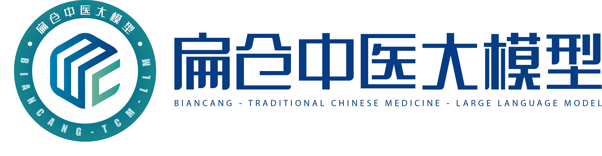
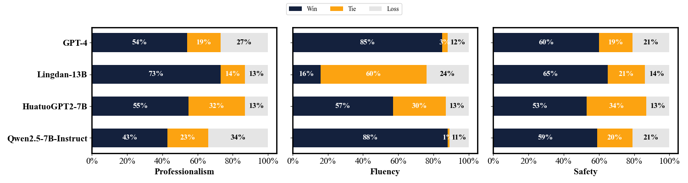

# 扁仓中医大模型

<div align="center">
    <p>
    
    </p>
    </div>
<div align="center">
  🌐<a href="README.md">zh</a> | <a href="README-en.md">en</a>
</div>

## 🎉新闻

- [11/18/2024] 我们在该仓库发布了扁仓系列模型，包括BianCang-Qwen2-7B、BianCang-Qwen2-7B-Instruct、BianCang-Qwen2.5-7B、BianCang-Qwen2.5-7B-Instruct。
- [11/18/2024] 我们公开了ChP-TCM数据集。

## 📅未来规划

- [ ] 开源BianCang-Qwen2.5-14B、BianCang-Qwen2.5-14B-Instruct。

## 💡介绍

你好，欢迎来到扁仓中医大模型的开源仓库。

为推动大语言模型在传统中医领域的落地应用，辅助医生进行疾病诊断，辅助患者进行自我评估，推动大模型赋能传统中医，我们在该仓库推出了**扁仓**系列中医大模型。扁仓是古代名医扁鹊、仓公的并称，泛指名医。我们期待扁仓中医大模型能够在延续中医传承和提升我国人民医疗健康水平方面做出一定的贡献。

扁仓以Qwen2/2.5作为基座，采用先注入领域知识再进行知识激活和对齐的两阶段训练方法而得到。扁仓在中医辨病辨证等中医特色任务上取得了最先进的性能，并且在各种医学执照考试中表现优异。

我们在该仓库中开源以下资源：

- 扁仓基座模型权重：包括BianCang-Qwen2-7B、BianCang-Qwen2.5-7B。

- 扁仓指令精调模型权重：包括BianCang-Qwen2-7B-Instruct、BianCang-Qwen2.5-7B-Instruct。


## 🤖模型

你可以在Huggingface上下载扁仓的模型权重：

| 模型                         | 基座                | 链接                                                         |
| ---------------------------- | ------------------- | ------------------------------------------------------------ |
| BianCang-Qwen2-7B            | Qwen2-7B            | [anonymous] |
| BianCang-Qwen2-7B-Instruct   | BianCang-Qwen2-7B   | [anonymous] |
| BianCang-Qwen2.5-7B          | Qwen2.5-7B          | [anonymous] |
| BianCang-Qwen2.5-7B-Instruct | BianCang-Qwen2.5-7B | [anonymous] |

也可以在ModelScope上下载扁仓的模型权重，这对国内网络更友好：

| 模型                         | 基座                | 链接                                                         |
| ---------------------------- | ------------------- | ------------------------------------------------------------ |
| BianCang-Qwen2-7B            | Qwen2-7B            | [anonymous] |
| BianCang-Qwen2-7B-Instruct   | BianCang-Qwen2-7B   | [anonymous] |
| BianCang-Qwen2.5-7B          | Qwen2.5-7B          | [anonymous] |
| BianCang-Qwen2.5-7B-Instruct | BianCang-Qwen2.5-7B | [anonymous] |

## 🚀推理

### 使用SWIFT

#### 环境安装

在[Release v2.4.2 · modelscope/ms-swift](https://github.com/modelscope/ms-swift/releases/tag/v2.4.2)处下载SWIFT源码，切换到对应目录，然后执行安装命令：

```shell
cd swift
pip install -e .
```

你可以根据自己的GPU驱动版本去选择合适的torch版本进行替换，SWIFT至少需要torch >= 1.13，推荐torch >= 2.0.0。

注意：由于我们进行SFT训练时使用的Chat Template为*qwen*，因此如果你使用的SWIFT版本大于我们提供的版本，可能会遇到Qwen2.5 Chat Template不对应的问题，请手动将Chat Template指定为*qwen*而不是*qwen2_5*。具体原因参考：[fix qwen2.5 template by Jintao-Huang · Pull Request #2081 · modelscope/ms-swift](https://github.com/modelscope/ms-swift/pull/2081)

#### 推理方式1-代码推理

```python
import os
os.environ['CUDA_VISIBLE_DEVICES'] = '0'

from swift.llm import (
    get_model_tokenizer, get_template, inference, ModelType
)
from swift.utils import seed_everything

model_type = ModelType.qwen2_5_7b_instruct
template_type = 'qwen'

model_id_or_path = 'BianCang-Qwen2.5-7B-Instruct'
model, tokenizer = get_model_tokenizer(model_type, model_id_or_path=model_id_or_path, model_kwargs={'device_map': 'auto'})
model.generation_config.max_new_tokens = 256

template = get_template(template_type, tokenizer)
seed_everything(42)
query = '你好，你是谁？'
response, history = inference(model, template, query)
print(f'query: {query}')
print(f'response: {response}')
query = '下面是一名患者的基本情况。年龄：78岁，性别：女。主 诉：活动后胸痛一周。现病史：患者一周前活动后出现胸口隐隐作痛，如针刺样乏力气短，活动后汗出，偏头痛。中医望闻切诊：表情自然，面色红润，形体正常,语气清,气息平；无异常气味,舌暗红，苔少。请你根据上述患者的主诉、病史和中医望闻切诊情况，判断该患者的主要中医疾病和中医证型，并给出中医辨病辨证的依据。'
response, history = inference(model, template, query, history)
print(f'query: {query}')
print(f'response: {response}')
print(f'history: {history}')
```

输出：

```
query: 你好，你是谁？
response: 你好！我是一个名为扁仓中医大模型的人工智能，由[anonymous]研发。我被设计成能够理解和生成自然语言文本，以便与人类进行中医辩证、中医处方推荐、中医知识问答、中医问题咨询等方面的对话交流，辅助人们完成疾病诊断相关的任务。请问有什么我可以帮助您的吗？
query: 下面是一名患者的基本情况。年龄：78岁，性别：女。主 诉：活动后胸痛一周。现病史：患者一周前活动后出现胸口隐隐作痛，如针刺样乏力气短，活动后汗出，偏头痛。中医望闻切诊：表情自然，面色红润，形体正常,语气清,气息平；无异常气味,舌暗红，苔少。请你根据上述患者的主诉、病史和中医望闻切诊情况，判断该患者的主要中医疾病和中医证型，并给出中医辨病辨证的依据。
response: 根据中医的诊断方法，患者患有胸痹心痛，中医证型属于气虚血瘀证。综合脉证，四诊合参，本病当属祖国医学“胸痹心痛病”范畴，证属“气虚血瘀”。患者素体虚弱，久病伤正，伤及心气，心气衰微，机能不健，致阴邪易于上乘阳位，况心脉为宗气之所，百脉朝会之枢，宗气的鼓动形成了心气推动血液运行全身，心气不足则血行无力瘀滞，发为本病，舌脉俱为佐证。
history: [['你好，你是谁？', '你好！我是一个名为扁仓中医大模型的人工智能，由[anonymous]研发。我被设计成能够理解和生成自然语言文本，以便与人类进行中医辩证、中医处方推荐、中医知识问答、中医问题咨询等方面的对话交流，辅助人们完成疾病诊断相关的任务。请问有什么我可以帮助您的吗？'], ['下面是一名患者的基本情况。年龄：78岁，性别：女。主 诉：活动后胸痛一周。现病史：患者一周前活动后出现胸口隐隐作痛，如针刺样乏力气短，活动后汗出，偏头痛。中医望闻切诊：表情自然，面色红润，形体正常,语气清,气息平；无异常气味,舌暗红，苔少。请你根据上述患者的主诉、病史和中医望闻切诊情况，判断该患者的主要中医疾病和中医证型，并给出中医辨病辨证的依据。', '根据中医的诊断方法，患者患有胸痹心痛，中医证型属于气虚血瘀证。综合脉证，四诊合参，本病当属祖国医学“胸痹心痛病”范畴，证属“气虚血瘀”。患者素体虚弱，久病伤正，伤及心气，心气衰微，机能不健，致阴邪易于上乘阳位，况心脉为宗气之所，百脉朝会之枢，宗气的鼓动形成了心气推动血液运行全身，心气不足则血行无力瘀滞，发为本病，舌脉俱为佐证。']]
```

#### 推理方式2-部署API

使用以下命令部署API：

```shell
CUDA_VISIBLE_DEVICES=0 swift deploy --model_type qwen2_5-7b-instruct --model_id_or_path BianCang-Qwen2.5-7B-Instruct --port 8090 --template_type qwen
```

使用curl进行测试：

```shell
curl http://localhost:8090/v1/chat/completions \
-H "Content-Type: application/json" \
-d '{
"model": "qwen2_5-7b-instruct",
"messages": [{"role": "user", "content": "你好，你是谁？"}],
"max_tokens": 256,
"temperature": 0.3
}'
```

响应如下：

```json
{"model":"qwen2_5-7b-instruct",
"choices":[{"index":0,"message":{"role":"assistant","content":"你好！我是一个名为扁仓中医大模型的人工智能，由[anonymous]研发。我被设计成能够理解和生成自然语言文本，以便与人类进行中医辩证、中医处方推荐、中医知识问答、中医问题咨询等方面的对话交流，辅助人们完成疾病诊断相关的任务。请问有什么我可以帮助您的吗？",
"tool_calls":null},"finish_reason":null,"logprobs":null}],
"usage":{"prompt_tokens":24,"completion_tokens":92,"total_tokens":116},
"id":"chatcmpl-6b4a02dee57a42238b27b5c40085df16",
"object":"chat.completion","created":1730209011}
```

使用代码进行测试：

```python
from swift.llm import get_model_list_client, XRequestConfig, inference_client

model_list = get_model_list_client(port=8090)
model_type = model_list.data[0].id
print(f'model_type: {model_type}')

query = "你好，你是谁？"
request_config = XRequestConfig(seed=42)
resp = inference_client(model_type, query, request_config=request_config, port=8090)
response = resp.choices[0].message.content
print(f'query: {query}')
print(f'response: {response}')

history = [(query, response)]
query = '下面是一名患者的基本情况。年龄：78岁，性别：女。主 诉：活动后胸痛一周。现病史：患者一周前活动后出现胸口隐隐作痛，如针刺样乏力气短，活动后汗出，偏头痛。中医望闻切诊：表情自然，面色红润，形体正常,语气清,气息平；无异常气味,舌暗红，苔少。请你根据上述患者的主诉、病史和中医望闻切诊情况，判断该患者的主要中医疾病和中医证型，并给出中医辨病辨证的依据。'
request_config = XRequestConfig(stream=True, seed=42)
stream_resp = inference_client(model_type, query, history, request_config=request_config, port=8090)
print(f'query: {query}')
print('response: ', end='')
for chunk in stream_resp:
    print(chunk.choices[0].delta.content, end='', flush=True)
print()
```

输出如下：

```
model_type: qwen2_5-7b-instruct
query: 你好，你是谁？
response: 你好！我是一个名为扁仓中医大模型的人工智能，由[anonymous]研发。我被设计成能够理解和生成自然语言文本，以便与人类进行中医辩证、中医处方推荐、中医知识问答、中医问题咨询等方面的对话交流，辅助人们完成疾病诊断相关的任务。请问有什么我可以帮助您的吗？
query: 下面是一名患者的基本情况。年龄：78岁，性别：女。主 诉：活动后胸痛一周。现病史：患者一周前活动后出现胸口隐隐作痛，如针刺样乏力气短，活动后汗出，偏头痛。中医望闻切诊：表情自然，面色红润，形体正常,语气清,气息平；无异常气味,舌暗红，苔少。请你根据上述患者的主诉、病史和中医望闻切诊情况，判断该患者的主要中医疾病和中医证型，并给出中医辨病辨证的依据。
response: 根据中医的诊断方法，患者患有胸痹心痛，中医证型属于气虚血瘀证。综合脉证，四诊合参，本病当属祖国医学“胸痹心痛病”范畴，证属“气虚血瘀”。患者素体虚弱，久病伤正，伤及心气，心气衰微，机能不健，致阴邪易于上乘阳位，况心脉为宗气之所，百脉朝会之枢，宗气的鼓动形成了心气推动血液运行全身，心气不足则血行无力瘀滞，发为本病，舌脉俱为佐证。
```

### 使用Transformers

你也可以使用transformers包进行推理：

```python
from transformers import AutoModelForCausalLM, AutoTokenizer

model_name = "BianCang-Qwen2.5-7B-Instruct"

model = AutoModelForCausalLM.from_pretrained(
    model_name,
    torch_dtype="auto",
    device_map="auto"
)
tokenizer = AutoTokenizer.from_pretrained(model_name)

prompt = "你好，你是谁？"
messages = [
    {"role": "system", "content": "You are a helpful assistant."},
    {"role": "user", "content": prompt}
]
text = tokenizer.apply_chat_template(
    messages,
    tokenize=False,
    add_generation_prompt=True
)
model_inputs = tokenizer([text], return_tensors="pt").to(model.device)

generated_ids = model.generate(
    **model_inputs,
    max_new_tokens=256
)
generated_ids = [
    output_ids[len(input_ids):] for input_ids, output_ids in zip(model_inputs.input_ids, generated_ids)
]

response = tokenizer.batch_decode(generated_ids, skip_special_tokens=True)[0]
print(response)

```

### 使用Web UI

我们提供了一个简单的演示Web UI。

安装streamlit：

```shell
pip install streamlit
```

使用SWIFT部署API：

```shell
CUDA_VISIBLE_DEVICES=0 swift deploy --model_type qwen2_5-7b-instruct --model_id_or_path BianCang-Qwen2.5-7B-Instruct --port 8090 --template_type qwen
```

启动streamlit：

```shell
streamlit run web_ui.py
```


## 🥇中医能力测试

<table border="1" cellpadding="5" cellspacing="0">
  <thead>
    <tr>
      <th rowspan="2">Model</th>
      <th colspan="4">TCM Syndrome Differentiation</th>
      <th colspan="4">TCM Disease Diagnosis</th>
      <th colspan="4">TCM Exam</th>
    </tr>
    <tr>
      <th colspan="2">TCMSD <br>Acc.(%)</th>
      <th colspan="2">TCMSD-BC<br> Acc.(%)</th>
      <th colspan="2">TCMDD<br> Acc.(%)</th>
      <th colspan="2">TCMDD-BC<br> Acc.(%)</th>
      <th colspan="2">MLEC-TCM<br> Acc.(%)</th>
      <th colspan="2">MLEC-CWM<br> Acc.(%)</th>
    </tr>
    <tr>
        <th></th><th>DI</th><th>CoT</th><th>DI</th><th>CoT</th><th>DI</th><th>CoT</th><th>DI</th><th>CoT</th><th>ZS</th><th>FS</th><th>ZS</th><th>FS</th>
    </tr>
  </thead>
  <tbody align="center" valign="center">
    <tr><td>GPT-4</td><td>24.53</td><td>45.21</td><td>16.67</td><td>70.73</td><td>27.83</td><td>54.54</td><td>41.80</td><td>68.33</td><td>74.70</td><td>76.35</td><td>76.26</td><td>76.37</td></tr>
    <tr><td>Qwen2-7B</td><td>31.74</td><td>27.18</td><td>32.73</td><td>28.40</td><td>41.60</td><td>54.59</td><td>74.87</td><td>77.93</td><td>86.01</td><td>89.18</td><td>84.45</td><td>87.89</td></tr>
    <tr><td>Qwen2-7B-Instruct</td><td>25.70</td><td>33.41</td><td>14.27</td><td>57.00</td><td>32.87</td><td>52.92</td><td>60.40</td><td>60.13</td><td>83.61</td><td>84.22</td><td>79.89</td><td>82.99</td></tr>
    <tr><td>Qwen2.5-7B</td><td>30.44</td><td>21.29</td><td>17.87</td><td>35.73</td><td>23.71</td><td>43.88</td><td>63.87</td><td>71.27</td><td>83.32</td><td>85.52</td><td>82.02</td><td>84.04</td></tr>
    <tr><td>Qwen2.5-7B-Instruct</td><td>24.30</td><td>32.19</td><td>9.93</td><td>57.07</td><td>36.29</td><td>51.51</td><td>62.93</td><td>55.53</td><td>78.72</td><td>79.88</td><td>77.27</td><td>78.43</td></tr>
    <tr><td>Qwen2.5-14B</td><td>35.62</td><td>25.21</td><td>33.93</td><td>30.13</td><td>24.33</td><td>36.64</td><td>33.33</td><td>32.80</td><td>86.59</td><td>89.93</td><td>87.10</td><td>90.06</td></tr>
    <tr><td>Qwen2.5-14B-Instruct</td><td>25.94</td><td>35.03</td><td>16.07</td><td>60.00</td><td>38.30</td><td>49.31</td><td>46.27</td><td>53.67</td><td>82.25</td><td>84.81</td><td>81.79</td><td>85.68</td></tr>
    <tr><td>BianCang-Qwen2-7B</td><td>42.14</td><td>30.30</td><td>57.80</td><td>48.00</td><td>43.73</td><td>54.67</td><td>74.73</td><td>80.67</td><td>90.86</td><td>91.87</td><td>89.08</td><td>90.36</td></tr>
    <tr><td>BianCang-Qwen2-7B-Instruct</td><td>68.88</td><td>75.96</td><td>57.33</td><td>75.40</td><td>64.42</td><td>77.71</td><td><b>89.07</b></td><td>85.67</td><td><b>92.39</b></td><td><b>92.39</b></td><td>91.14</td><td>91.48</td></tr>
    <tr><td>BianCang-Qwen2.5-7B</td><td>46.57</td><td>26.72</td><td>52.93</td><td>45.47</td><td>49.80</td><td>53.15</td><td>68.13</td><td>61.73</td><td>86.46</td><td>86.30</td><td>83.93</td><td>85.35</td></tr>
    <tr><td>BianCang-Qwen2.5-7B-Instruct</td><td>78.90</td><td><b>82.10</b></td><td><b>66.73</b></td><td><b>77.73</b></td><td>73.73</td><td><b>82.65</b></td><td>87.87</td><td><b>89.40</b></td><td>90.22</td><td>90.57</td><td>90.32</td><td>90.62</td></tr>
    <tr><td>BianCang-Qwen2.5-14B</td><td>43.77</td><td>33.96</td><td>61.93</td><td>53.47</td><td>66.61</td><td>60.39</td><td>82.93</td><td>77.07</td><td>89.28</td><td>90.86</td><td>89.42</td><td>90.58</td></tr>
    <tr><td>BianCang-Qwen2.5-14B-Instruct</td><td><b>79.38</b></td><td>75.54</td><td>62.27</td><td>70.73</td><td><b>77.63</b></td><td>82.05</td><td>86.33</td><td>88.73</td><td>92.29</td><td>92.29</td><td><b>92.75</b></td><td><b>92.86</b></td></tr>
  </tbody>
</table>

<br>

<table border="1">
  <tr>
    <th>Model</th>
    <th>CMB Acc.(%)</th>
    <th colspan="2">MLEC-Clinic <br>Acc.(%)</th>
    <th colspan="2">MLEC-PublicHealth<br> Acc.(%)</th>
    <th colspan="2">MLEC-Stomatology<br> Acc.(%)</th>
  </tr>
  <tr>
    <th></th>
    <th>ZS/FS</th>
    <th>ZS</th>
    <th>FS</th>
    <th>ZS</th>
    <th>FS</th>
    <th>ZS</th>
    <th>FS</th>
  </tr>
  <tr>
    <td>GPT-4</td>
    <td>59.46*</td>
    <td>82.63</td>
    <td>82.69</td>
    <td>81.55</td>
    <td>82.58</td>
    <td>72.97</td>
    <td>75.43</td>
  </tr>
  <tr>
    <td>Qwen2-7B</td>
    <td>81.63</td>
    <td>87.63</td>
    <td>90.63</td>
    <td>82.63</td>
    <td>86.79</td>
    <td>80.34</td>
    <td>84.65</td>
  </tr>
  <tr>
    <td>Qwen2-7B-Instruct</td>
    <td>83.45</td>
    <td>85.16</td>
    <td>83.35</td>
    <td>81.61</td>
    <td>81.07</td>
    <td>76.29</td>
    <td>75.88</td>
  </tr>
  <tr>
    <td>Qwen2.5-7B</td>
    <td>79.60</td>
    <td>86.65</td>
    <td>88.55</td>
    <td>83.39</td>
    <td>85.17</td>
    <td>78.03</td>
    <td>80.79</td>
  </tr>
  <tr>
    <td>Qwen2.5-7B-Instruct</td>
    <td>79.51</td>
    <td>82.81</td>
    <td>83.73</td>
    <td>80.96</td>
    <td>80.85</td>
    <td>72.93</td>
    <td>74.40</td>
  </tr>
  <tr>
    <td>Qwen2.5-14B</td>
    <td>84.07</td>
    <td>90.40</td>
    <td>93.13</td>
    <td>86.46</td>
    <td>89.54</td>
    <td>84.31</td>
    <td>88.20</td>
  </tr>
  <tr>
    <td>Qwen2.5-14B-Instruct</td>
    <td>83.69</td>
    <td>86.47</td>
    <td>88.02</td>
    <td>83.17</td>
    <td>86.14</td>
    <td>78.94</td>
    <td>82.57</td>
  </tr>
  <tr>
    <td>BianCang-Qwen2-7B (Ours)</td>
    <td>83.27</td>
    <td>91.88</td>
    <td>93.31</td>
    <td>88.57</td>
    <td>90.72</td>
    <td>85.29</td>
    <td>88.47</td>
  </tr>
  <tr>
    <td>BianCang-Qwen2-7B-Instruct (Ours)</td>
    <td>84.08</td>
    <td>94.35</td>
    <td>94.35</td>
    <td>91.37</td>
    <td><b>91.64</b></td>
    <td>89.19</td>
    <td>90.02</td>
  </tr>
  <tr>
    <td>BianCang-Qwen2.5-7B (Ours)</td>
    <td>80.13</td>
    <td>90.43</td>
    <td>91.32</td>
    <td>85.65</td>
    <td>87.22</td>
    <td>82.19</td>
    <td>82.65</td>
  </tr>
  <tr>
    <td>BianCang-Qwen2.5-7B-Instruct (Ours)</td>
    <td>80.71</td>
    <td>93.40</td>
    <td>93.43</td>
    <td>89.91</td>
    <td>89.91</td>
    <td>86.43</td>
    <td>86.77</td>
  </tr>
  <tr>
    <td>BianCang-Qwen2.5-14B (Ours)</td>
    <td><b>84.34</b></td>
    <td>91.70</td>
    <td>93.37</td>
    <td>87.92</td>
    <td>89.97</td>
    <td>86.16</td>
    <td>87.94</td>
  </tr>
  <tr>
    <td>BianCang-Qwen2.5-14B-Instruct (Ours)</td>
    <td>83.80</td>
    <td><b>94.74</b></td>
    <td><b>94.97</b></td>
    <td><b>91.86</b></td>
    <td>91.53</td>
    <td><b>90.43</b></td>
    <td><b>90.51</b></td>
  </tr>
</table>

<div align="center">
<p>
    
    </p>
</div>

更多测评结果请关注我们的技术报告。

## 🧡致谢

本项目基于开源项目进行开发，在此对相关项目和研究开发人员表示感谢。

- [Qwen2](https://github.com/vitanova/Qwen2)
- [Qwen2.5](https://github.com/QwenLM/Qwen2.5)
- [SWIFT](https://github.com/modelscope/ms-swift)
- [ModelScope](https://github.com/modelscope/modelscope)
- [ShenNong-TCM-LLM](https://github.com/michael-wzhu/ShenNong-TCM-LLM?tab=readme-ov-file)
- [HuatuoGPT-II](https://github.com/FreedomIntelligence/HuatuoGPT-II)
- [DISC-MedLLM](https://github.com/FudanDISC/DISC-MedLLM)
- [MLEC-QA](https://github.com/Judenpech/MLEC-QA)
- [CMB](https://github.com/FreedomIntelligence/CMB?tab=readme-ov-file)
- [ZY-BERT](https://github.com/Borororo/ZY-BERT)
- [COIG](https://github.com/BAAI-Zlab/COIG)
- [APE210k](https://github.com/Chenny0808/ape210k)
- [Evol-Instruction-66K](https://github.com/Continuum-Labs-HQ/EvolInstruct)


## ❕免责声明

- 本项目相关资源仅供学术研究之用。
- 扁仓中医大模型作为基于语言模型的智能助手，具有局限性，无法保证所有响应的准确性，其不能代替中医/西医进行医学诊断和给出医学建议。如有需要，请咨询专业医生或前往医院就诊。
- 由于医疗领域的数据不准确可能造成严重后果，我们强烈建议用户在处理生成的信息时要小心谨慎，并向专家寻求建议。


