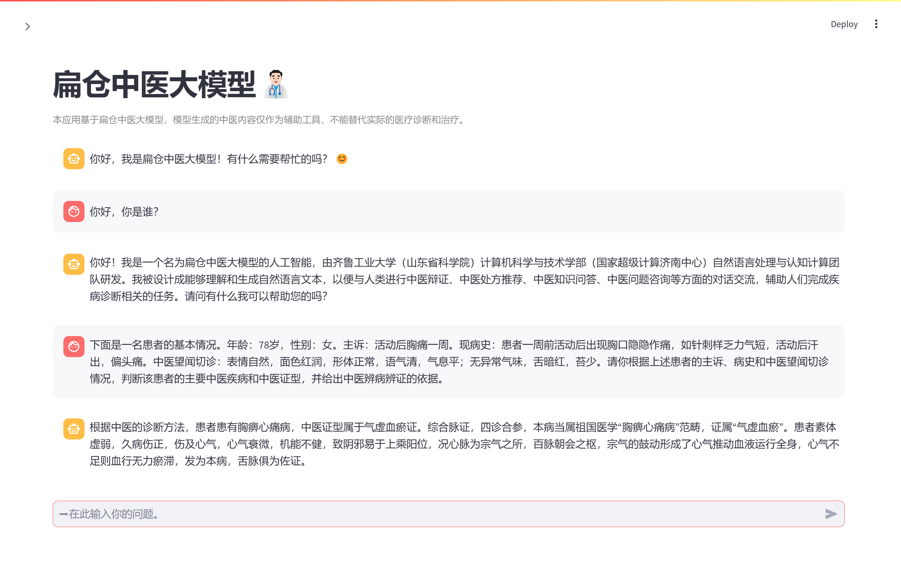

# 扁仓中医大模型（BianCang: A Traditional Chinese Medicine Large Language Model）

<div align="center">
    <p>
    
    </p>
    </div>
<p align="center">
💻 <a href="" target="_blank">Online Experience (to be opened)</a> ｜⬇️ <a href="https://huggingface.co/QLU-NLP" target="_blank">HuggingFace Download</a> ｜⬇️ <a href="https://www.modelscope.cn/profile/QLUNLP" target="_blank">ModelScope Download</a>  ｜ 📃 <a href="https://arxiv.org/abs/2411.11027" target="_blank">Paper</a> <br>
</p>

<div align="center">
  🌐<a href="README.md">zh</a> | <a href="README-en.md">en</a>
</div>

## 🎉News

- [11/18/2024] We released the BianCang series models in this repository, including BianCang-Qwen2-7B, BianCang-Qwen2-7B-Instruct, BianCang-Qwen2.5-7B, and BianCang-Qwen2.5-7B-Instruct.
- [11/18/2024] We made the ChP-TCM dataset publicly available.
- [11/18/2024] We published the BianCang technical report. BianCang has achieved state-of-the-art results in the field of Traditional Chinese Medicine.
- [10/28/2024] On October 28th, the "Supercomputing, Intelligent Creation of the Future" Top Scientists Forum was held in Jinan, Shandong. During the conference, six academicians, including Daxiang Liu, Runsheng Chen, Hongke Zhang, Juncheng Wang, Jinde Cao, and Qinxi Dong, jointly released a series of large language models from the National Supercomputing Center in Jinan, including the "BianCang Traditional Chinese Medicine Large Language Model". Detailed reports were covered by Shandong News, Dazhong Daily, Jinan Daily, and Jinan News.

## 📅Future Plans

- [ ] Open-source BianCang-Qwen2.5-14B and BianCang-Qwen2.5-14B-Instruct.

## 💡Introduction

Hello, welcome to the open-source repository of the BianCang Traditional Chinese Medicine Large Language Model.

To promote the application of large language models in the field of Traditional Chinese Medicine (TCM), assist doctors in disease diagnosis, help patients with self-assessment, and empower TCM with large language models, we have launched the **BianCang** series of TCM large language models in this repository. BianCang is named after the ancient famous physicians Bian Que and Cang Gong, symbolizing renowned doctors. We hope that the BianCang TCM Large Language Model can contribute to the continuation of TCM heritage and the improvement of healthcare in China.

BianCang is based on Qwen2/2.5 and is developed using a two-stage training method: first injecting domain knowledge, then activating and aligning the knowledge. BianCang has achieved state-of-the-art performance in TCM-specific tasks such as disease diagnosis and syndrome differentiation, and has performed excellently in various medical licensing exams.

In this repository, we open-source the following resources:

- BianCang base model weights: including BianCang-Qwen2-7B and BianCang-Qwen2.5-7B.
- BianCang instruction-tuned model weights: including BianCang-Qwen2-7B-Instruct and BianCang-Qwen2.5-7B-Instruct.


## 🤖Models

You can download BianCang's model weights from Huggingface:

| Model                        | Base                | Link                                                         |
| ---------------------------- | ------------------- | ------------------------------------------------------------ |
| BianCang-Qwen2-7B            | Qwen2-7B            | [HF](https://huggingface.co/QLU-NLP/BianCang-Qwen2-7B)       |
| BianCang-Qwen2-7B-Instruct   | BianCang-Qwen2-7B   | [HF](https://huggingface.co/QLU-NLP/BianCang-Qwen2-7B-Instruct) |
| BianCang-Qwen2.5-7B          | Qwen2.5-7B          | [HF](https://huggingface.co/QLU-NLP/BianCang-Qwen2.5-7B)     |
| BianCang-Qwen2.5-7B-Instruct | BianCang-Qwen2.5-7B | [HF](https://huggingface.co/QLU-NLP/BianCang-Qwen2.5-7B-Instruct) |

You can also download BianCang's model weights from ModelScope:

| Model                        | Base                | Link                                                         |
| ---------------------------- | ------------------- | ------------------------------------------------------------ |
| BianCang-Qwen2-7B            | Qwen2-7B            | [MS](https://www.modelscope.cn/models/QLUNLP/BianCang-Qwen2.5-7B) |
| BianCang-Qwen2-7B-Instruct   | BianCang-Qwen2-7B   | [MS](https://www.modelscope.cn/models/QLUNLP/BianCang-Qwen2-7B-Instruct) |
| BianCang-Qwen2.5-7B          | Qwen2.5-7B          | [MS](https://www.modelscope.cn/models/QLUNLP/BianCang-Qwen2.5-7B) |
| BianCang-Qwen2.5-7B-Instruct | BianCang-Qwen2.5-7B | [MS](https://www.modelscope.cn/models/QLUNLP/BianCang-Qwen2.5-7B-Instruct) |

## 🚀Inference

### Using SWIFT

#### Environment Setup

Download the SWIFT source code from [Release v2.4.2 · modelscope/ms-swift](https://github.com/modelscope/ms-swift/releases/tag/v2.4.2), switch to the corresponding directory, and execute the installation command:

```shell
cd swift
pip install -e .
```

You can choose the appropriate torch version based on your GPU driver version. SWIFT requires at least torch >= 1.13, and torch >= 2.0.0 is recommended.

Note: Since we used the *qwen* Chat Template during SFT training, if you use a SWIFT version higher than the one we provided, you may encounter issues with the Qwen2.5 Chat Template not matching. Please manually specify the Chat Template as *qwen* instead of *qwen2_5*. For details, refer to: [fix qwen2.5 template by Jintao-Huang · Pull Request #2081 · modelscope/ms-swift](https://github.com/modelscope/ms-swift/pull/2081)

#### Inference Method 1 - Code Inference

```python
import os
os.environ['CUDA_VISIBLE_DEVICES'] = '0'

from swift.llm import (
    get_model_tokenizer, get_template, inference, ModelType
)
from swift.utils import seed_everything

model_type = ModelType.qwen2_5_7b_instruct
template_type = 'qwen'

model_id_or_path = 'QLU-NLP/BianCang-Qwen2.5-7B-Instruct'
model, tokenizer = get_model_tokenizer(model_type, model_id_or_path=model_id_or_path, model_kwargs={'device_map': 'auto'})
model.generation_config.max_new_tokens = 256

template = get_template(template_type, tokenizer)
seed_everything(42)
query = '你好，你是谁？'
response, history = inference(model, template, query)
print(f'query: {query}')
print(f'response: {response}')
query = '下面是一名患者的基本情况。年龄：78岁，性别：女。主 诉：活动后胸痛一周。现病史：患者一周前活动后出现胸口隐隐作痛，如针刺样乏力气短，活动后汗出，偏头痛。中医望闻切诊：表情自然，面色红润，形体正常,语气清,气息平；无异常气味,舌暗红，苔少。请你根据上述患者的主诉、病史和中医望闻切诊情况，判断该患者的主要中医疾病和中医证型，并给出中医辨病辨证的依据。'
response, history = inference(model, template, query, history)
print(f'query: {query}')
print(f'response: {response}')
print(f'history: {history}')
```

#### Inference Method 2 - Deploy API

Use the following command to deploy the API:

```shell
CUDA_VISIBLE_DEVICES=0 swift deploy --model_type qwen2_5-7b-instruct --model_id_or_path QLU-NLP/BianCang-Qwen2.5-7B-Instruct --port 8090 --template_type qwen
```

Test using curl:

```shell
curl http://localhost:8090/v1/chat/completions \
-H "Content-Type: application/json" \
-d '{
"model": "qwen2_5-7b-instruct",
"messages": [{"role": "user", "content": "你好，你是谁？"}],
"max_tokens": 256,
"temperature": 0.3
}'
```

Test using code:

```python
from swift.llm import get_model_list_client, XRequestConfig, inference_client

model_list = get_model_list_client(port=8090)
model_type = model_list.data[0].id
print(f'model_type: {model_type}')

query = "你好，你是谁？"
request_config = XRequestConfig(seed=42)
resp = inference_client(model_type, query, request_config=request_config, port=8090)
response = resp.choices[0].message.content
print(f'query: {query}')
print(f'response: {response}')

history = [(query, response)]
query = '下面是一名患者的基本情况。年龄：78岁，性别：女。主 诉：活动后胸痛一周。现病史：患者一周前活动后出现胸口隐隐作痛，如针刺样乏力气短，活动后汗出，偏头痛。中医望闻切诊：表情自然，面色红润，形体正常,语气清,气息平；无异常气味,舌暗红，苔少。请你根据上述患者的主诉、病史和中医望闻切诊情况，判断该患者的主要中医疾病和中医证型，并给出中医辨病辨证的依据。'
request_config = XRequestConfig(stream=True, seed=42)
stream_resp = inference_client(model_type, query, history, request_config=request_config, port=8090)
print(f'query: {query}')
print('response: ', end='')
for chunk in stream_resp:
    print(chunk.choices[0].delta.content, end='', flush=True)
print()
```

### Using Transformers

You can also use the transformers package for inference:

```python
from transformers import AutoModelForCausalLM, AutoTokenizer

model_name = "QLU-NLP/BianCang-Qwen2.5-7B-Instruct"

model = AutoModelForCausalLM.from_pretrained(
    model_name,
    torch_dtype="auto",
    device_map="auto"
)
tokenizer = AutoTokenizer.from_pretrained(model_name)

prompt = "你好，你是谁？"
messages = [
    {"role": "system", "content": "You are a helpful assistant."},
    {"role": "user", "content": prompt}
]
text = tokenizer.apply_chat_template(
    messages,
    tokenize=False,
    add_generation_prompt=True
)
model_inputs = tokenizer([text], return_tensors="pt").to(model.device)

generated_ids = model.generate(
    **model_inputs,
    max_new_tokens=256
)
generated_ids = [
    output_ids[len(input_ids):] for input_ids, output_ids in zip(model_inputs.input_ids, generated_ids)
]

response = tokenizer.batch_decode(generated_ids, skip_special_tokens=True)[0]
print(response)

```

### Using Web UI

We provide a simple demo Web UI.

Install streamlit:

```shell
pip install streamlit
```

Deploy API using SWIFT:

```shell
CUDA_VISIBLE_DEVICES=0 swift deploy --model_type qwen2_5-7b-instruct --model_id_or_path QLU-NLP/BianCang-Qwen2.5-7B-Instruct --port 8090 --template_type qwen
```

Start streamlit:

```shell
streamlit run web_ui.py
```



## 🥇TCM Capability Testing

<table border="1" cellpadding="5" cellspacing="0">
  <thead>
    <tr>
      <th rowspan="2">Model</th>
      <th colspan="4">TCM Syndrome Differentiation</th>
      <th colspan="4">TCM Disease Diagnosis</th>
      <th colspan="4">TCM Exam</th>
    </tr>
    <tr>
      <th colspan="2">TCMSD <br>Acc.(%)</th>
      <th colspan="2">TCMSD-BC<br> Acc.(%)</th>
      <th colspan="2">TCMDD<br> Acc.(%)</th>
      <th colspan="2">TCMDD-BC<br> Acc.(%)</th>
      <th colspan="2">MLEC-TCM<br> Acc.(%)</th>
      <th colspan="2">MLEC-CWM<br> Acc.(%)</th>
    </tr>
    <tr>
        <th></th><th>DI</th><th>CoT</th><th>DI</th><th>CoT</th><th>DI</th><th>CoT</th><th>DI</th><th>CoT</th><th>ZS</th><th>FS</th><th>ZS</th><th>FS</th>
    </tr>
  </thead>
  <tbody align="center" valign="center">
    <tr><td>GPT-4</td><td>24.53</td><td>45.21</td><td>16.67</td><td>70.73</td><td>27.83</td><td>54.54</td><td>41.80</td><td>68.33</td><td>74.70</td><td>76.35</td><td>76.26</td><td>76.37</td></tr>
    <tr><td>Qwen2-7B</td><td>31.74</td><td>27.18</td><td>32.73</td><td>28.40</td><td>41.60</td><td>54.59</td><td>74.87</td><td>77.93</td><td>86.01</td><td>89.18</td><td>84.45</td><td>87.89</td></tr>
    <tr><td>Qwen2-7B-Instruct</td><td>25.70</td><td>33.41</td><td>14.27</td><td>57.00</td><td>32.87</td><td>52.92</td><td>60.40</td><td>60.13</td><td>83.61</td><td>84.22</td><td>79.89</td><td>82.99</td></tr>
    <tr><td>Qwen2.5-7B</td><td>30.44</td><td>21.29</td><td>17.87</td><td>35.73</td><td>23.71</td><td>43.88</td><td>63.87</td><td>71.27</td><td>83.32</td><td>85.52</td><td>82.02</td><td>84.04</td></tr>
    <tr><td>Qwen2.5-7B-Instruct</td><td>24.30</td><td>32.19</td><td>9.93</td><td>57.07</td><td>36.29</td><td>51.51</td><td>62.93</td><td>55.53</td><td>78.72</td><td>79.88</td><td>77.27</td><td>78.43</td></tr>
    <tr><td>Qwen2.5-14B</td><td>35.62</td><td>25.21</td><td>33.93</td><td>30.13</td><td>24.33</td><td>36.64</td><td>33.33</td><td>32.80</td><td>86.59</td><td>89.93</td><td>87.10</td><td>90.06</td></tr>
    <tr><td>Qwen2.5-14B-Instruct</td><td>25.94</td><td>35.03</td><td>16.07</td><td>60.00</td><td>38.30</td><td>49.31</td><td>46.27</td><td>53.67</td><td>82.25</td><td>84.81</td><td>81.79</td><td>85.68</td></tr>
    <tr><td>BianCang-Qwen2-7B</td><td>42.14</td><td>30.30</td><td>57.80</td><td>48.00</td><td>43.73</td><td>54.67</td><td>74.73</td><td>80.67</td><td>90.86</td><td>91.87</td><td>89.08</td><td>90.36</td></tr>
    <tr><td>BianCang-Qwen2-7B-Instruct</td><td>68.88</td><td>75.96</td><td>57.33</td><td>75.40</td><td>64.42</td><td>77.71</td><td><b>89.07</b></td><td>85.67</td><td><b>92.39</b></td><td><b>92.39</b></td><td>91.14</td><td>91.48</td></tr>
    <tr><td>BianCang-Qwen2.5-7B</td><td>46.57</td><td>26.72</td><td>52.93</td><td>45.47</td><td>49.80</td><td>53.15</td><td>68.13</td><td>61.73</td><td>86.46</td><td>86.30</td><td>83.93</td><td>85.35</td></tr>
    <tr><td>BianCang-Qwen2.5-7B-Instruct</td><td>78.90</td><td><b>82.10</b></td><td><b>66.73</b></td><td><b>77.73</b></td><td>73.73</td><td><b>82.65</b></td><td>87.87</td><td><b>89.40</b></td><td>90.22</td><td>90.57</td><td>90.32</td><td>90.62</td></tr>
    <tr><td>BianCang-Qwen2.5-14B</td><td>43.77</td><td>33.96</td><td>61.93</td><td>53.47</td><td>66.61</td><td>60.39</td><td>82.93</td><td>77.07</td><td>89.28</td><td>90.86</td><td>89.42</td><td>90.58</td></tr>
    <tr><td>BianCang-Qwen2.5-14B-Instruct</td><td><b>79.38</b></td><td>75.54</td><td>62.27</td><td>70.73</td><td><b>77.63</b></td><td>82.05</td><td>86.33</td><td>88.73</td><td>92.29</td><td>92.29</td><td><b>92.75</b></td><td><b>92.86</b></td></tr>
  </tbody>
</table>

<br>

<table border="1">
  <tr>
    <th>Model</th>
    <th>CMB Acc.(%)</th>
    <th colspan="2">MLEC-Clinic <br>Acc.(%)</th>
    <th colspan="2">MLEC-PublicHealth<br> Acc.(%)</th>
    <th colspan="2">MLEC-Stomatology<br> Acc.(%)</th>
  </tr>
  <tr>
    <th></th>
    <th>ZS/FS</th>
    <th>ZS</th>
    <th>FS</th>
    <th>ZS</th>
    <th>FS</th>
    <th>ZS</th>
    <th>FS</th>
  </tr>
  <tr>
    <td>GPT-4</td>
    <td>59.46*</td>
    <td>82.63</td>
    <td>82.69</td>
    <td>81.55</td>
    <td>82.58</td>
    <td>72.97</td>
    <td>75.43</td>
  </tr>
  <tr>
    <td>Qwen2-7B</td>
    <td>81.63</td>
    <td>87.63</td>
    <td>90.63</td>
    <td>82.63</td>
    <td>86.79</td>
    <td>80.34</td>
    <td>84.65</td>
  </tr>
  <tr>
    <td>Qwen2-7B-Instruct</td>
    <td>83.45</td>
    <td>85.16</td>
    <td>83.35</td>
    <td>81.61</td>
    <td>81.07</td>
    <td>76.29</td>
    <td>75.88</td>
  </tr>
  <tr>
    <td>Qwen2.5-7B</td>
    <td>79.60</td>
    <td>86.65</td>
    <td>88.55</td>
    <td>83.39</td>
    <td>85.17</td>
    <td>78.03</td>
    <td>80.79</td>
  </tr>
  <tr>
    <td>Qwen2.5-7B-Instruct</td>
    <td>79.51</td>
    <td>82.81</td>
    <td>83.73</td>
    <td>80.96</td>
    <td>80.85</td>
    <td>72.93</td>
    <td>74.40</td>
  </tr>
  <tr>
    <td>Qwen2.5-14B</td>
    <td>84.07</td>
    <td>90.40</td>
    <td>93.13</td>
    <td>86.46</td>
    <td>89.54</td>
    <td>84.31</td>
    <td>88.20</td>
  </tr>
  <tr>
    <td>Qwen2.5-14B-Instruct</td>
    <td>83.69</td>
    <td>86.47</td>
    <td>88.02</td>
    <td>83.17</td>
    <td>86.14</td>
    <td>78.94</td>
    <td>82.57</td>
  </tr>
  <tr>
    <td>BianCang-Qwen2-7B (Ours)</td>
    <td>83.27</td>
    <td>91.88</td>
    <td>93.31</td>
    <td>88.57</td>
    <td>90.72</td>
    <td>85.29</td>
    <td>88.47</td>
  </tr>
  <tr>
    <td>BianCang-Qwen2-7B-Instruct (Ours)</td>
    <td>84.08</td>
    <td>94.35</td>
    <td>94.35</td>
    <td>91.37</td>
    <td><b>91.64</b></td>
    <td>89.19</td>
    <td>90.02</td>
  </tr>
  <tr>
    <td>BianCang-Qwen2.5-7B (Ours)</td>
    <td>80.13</td>
    <td>90.43</td>
    <td>91.32</td>
    <td>85.65</td>
    <td>87.22</td>
    <td>82.19</td>
    <td>82.65</td>
  </tr>
  <tr>
    <td>BianCang-Qwen2.5-7B-Instruct (Ours)</td>
    <td>80.71</td>
    <td>93.40</td>
    <td>93.43</td>
    <td>89.91</td>
    <td>89.91</td>
    <td>86.43</td>
    <td>86.77</td>
  </tr>
  <tr>
    <td>BianCang-Qwen2.5-14B (Ours)</td>
    <td><b>84.34</b></td>
    <td>91.70</td>
    <td>93.37</td>
    <td>87.92</td>
    <td>89.97</td>
    <td>86.16</td>
    <td>87.94</td>
  </tr>
  <tr>
    <td>BianCang-Qwen2.5-14B-Instruct (Ours)</td>
    <td>83.80</td>
    <td><b>94.74</b></td>
    <td><b>94.97</b></td>
    <td><b>91.86</b></td>
    <td>91.53</td>
    <td><b>90.43</b></td>
    <td><b>90.51</b></td>
  </tr>
</table>


For more evaluation results, please refer to our technical report.

## 🧡Acknowledgments

This project is developed based on open-source projects. We would like to thank the developers and researchers of the following projects:

- [Qwen2](https://github.com/vitanova/Qwen2)
- [Qwen2.5](https://github.com/QwenLM/Qwen2.5)
- [SWIFT](https://github.com/modelscope/ms-swift)
- [ModelScope](https://github.com/modelscope/modelscope)
- [ShenNong-TCM-LLM](https://github.com/michael-wzhu/ShenNong-TCM-LLM?tab=readme-ov-file)
- [HuatuoGPT-II](https://github.com/FreedomIntelligence/HuatuoGPT-II)
- [DISC-MedLLM](https://github.com/FudanDISC/DISC-MedLLM)
- [MLEC-QA](https://github.com/Judenpech/MLEC-QA)
- [CMB](https://github.com/FreedomIntelligence/CMB?tab=readme-ov-file)
- [ZY-BERT](https://github.com/Borororo/ZY-BERT)
- [COIG](https://github.com/BAAI-Zlab/COIG)
- [APE210k](https://github.com/Chenny0808/ape210k)
- [Evol-Instruction-66K](https://github.com/Continuum-Labs-HQ/EvolInstruct)

## ❔About Us

This project is a collaboration between the Natural Language Processing and Cognitive Computing team at the School of Computer Science and Technology (National Supercomputing Center in Jinan) of Qilu University of Technology (Shandong Academy of Sciences) and the Clinical Research Center of Shandong University of Traditional Chinese Medicine Affiliated Hospital.

<div align="center">
<p>
    
    </p>
</div>


<div align="center">
    <p>
        
    </p>
</div>

<p>
<div align="center">
<p>
     
    </p>   
</div>

## ❕Disclaimer

- The resources in this project are for academic research purposes only.
- BianCang as a language model-based intelligent assistant, has limitations and cannot guarantee the accuracy of all responses. It cannot replace TCM/Western medicine for medical diagnosis or provide medical advice. If needed, please consult a professional doctor or visit a hospital.
- Due to the potential serious consequences of inaccurate medical data, we strongly recommend users to handle generated information with caution and seek advice from experts.

## 📖Citation

```
@article{Wei2024BianCang,
  title={BianCang: A Traditional Chinese Medicine Large Language Model},
  author={Sibo, Wei and  Xueping, Peng and Yi-fei, Wang and Jiasheng, Si and Weiyu, Zhang and Wenpeng, Lu and Xiaoming, Wu and Yinglong, Wang},
  journal={arXiv preprint arXiv:2411.11027},
  year={2024}
}
```


